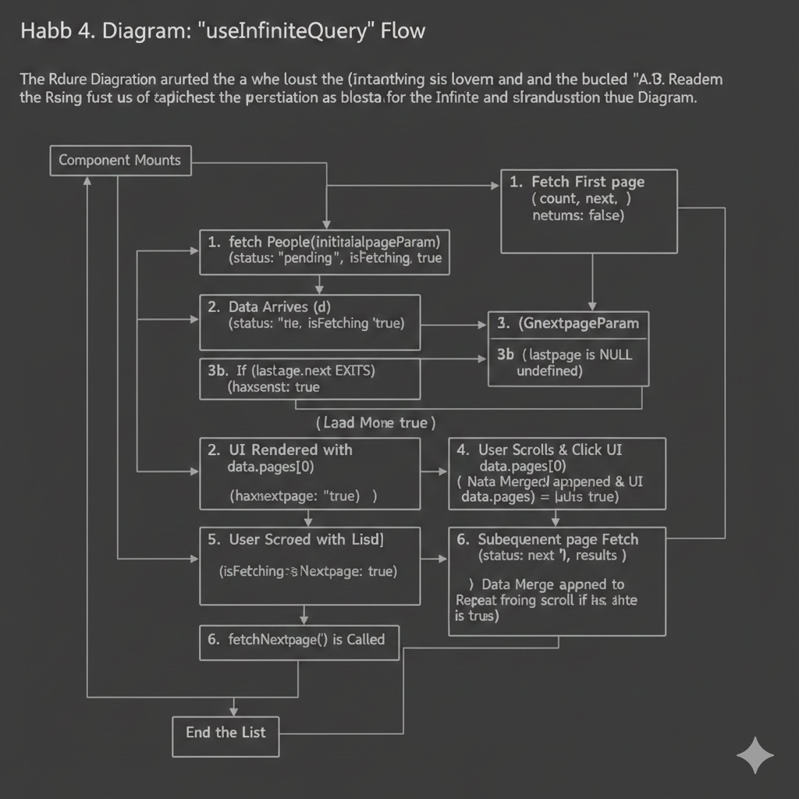

# React Query: Server State Management in React

# base-blog-em project
## 1. Creating Queries and Loading Error States
React Query (TanStack Query) is a powerful library for managing server state in React applications.

### 1.1. Difference between Client State and Server state
- Client State : information relevant(specific) to browser session.
  - Example: user's chosen language or theme
- Server State : information stored on server but needed to display in client
  - Example: blog post data form the database

### 1.2. What problems does React Query solve?

#### a. **Intelligent Caching System**
- Maintains cache of server data on the client side
- Automatically serves cached data while fetching fresh data in background
- Example: In my blog app, when navigating between pages, previously loaded posts are instantly available

#### b. **Cache Invalidation & Synchronization**
- **Imperatively**: Manually invalidate data using `queryClient.invalidateQueries()`
- **Declaratively**: Auto-refresh on window focus, network reconnection, or custom intervals
- Example: My blog posts refresh when you switch browser tabs and come back

#### c. **Built-in Loading & Error States**
- Provides `isLoading`, `isError`, `error` states for every query
- No need to manually manage loading spinners or error handling
- Example: my Posts component shows "Loading..." automatically

#### d. **Advanced Data Fetching Patterns**
- **Pagination**: Easy page-by-page data loading with `useQuery`
- **Infinite Scroll**: `useInfiniteQuery` for endless data loading
- **Prefetching**: Load next page data before user requests it
- Example: My SWAPI infinite scroll loads Star Wars characters seamlessly

#### e. **Request Deduplication**
- Multiple components requesting same data = only one network request
- Queries identified by unique keys (e.g., `["posts", pageNumber]`)
- Example: If 3 components need the same blog post, only 1 API call is made

#### f. **Mutation Management**
- Handle POST/PUT/DELETE operations with `useMutation`
- Automatic cache updates after successful mutations
- Example: Deleting a blog post updates the UI immediately

#### g. **Automatic Retry Logic**
- Failed requests automatically retry with exponential backoff
- Configurable retry attempts and conditions
- Reduces manual error handling code

#### h. **Lifecycle Callbacks**
- `onSuccess`, `onError`, `onSettled` callbacks for custom actions
- Perfect for showing toast notifications or logging
- Example: Show success message after updating a post

For SSR, see `https://tanstack.com/query/latest/docs/framework/react/guides/ssr`

### 1.3. General steps for adding React Query to my project

#### Step 1: Install the library
```bash
npm install @tanstack/react-query
npm install @tanstack/react-query-devtools  # Optional but recommended
```
**What this does**: Installs the core React Query library and the devtools for debugging queries in development.

#### Step 2: Create QueryClient
```jsx
import { QueryClient } from "@tanstack/react-query";

const queryClient = new QueryClient();
```
**What this does**: Creates a client that manages all queries and their cache. This is the "brain" that handles caching, background updates, and query coordination.

#### Step 3: Wrap app with QueryClientProvider
```jsx
import { QueryClientProvider } from "@tanstack/react-query";
import { ReactQueryDevtools } from "@tanstack/react-query-devtools";

function App() {
  return (
    <QueryClientProvider client={queryClient}>
      <div className="App">
        {/* Your app components */}
      </div>
      <ReactQueryDevtools />  {/* Development only */}
    </QueryClientProvider>
  );
}
```
**What this does**: Makes the QueryClient available to all child components via React Context. Any component inside this provider can now use React Query hooks.

#### Step 4: Use the useQuery hook
```jsx
import { useQuery } from "@tanstack/react-query";

function Posts() {
  const { data, isLoading, isError, error } = useQuery({
    queryKey: ["posts"],
    queryFn: () => fetchPosts(),
  });

  if (isLoading) return <div>Loading...</div>;
  if (isError) return <div>Error: {error.message}</div>;

  return (
    <ul>
      {data.map(post => <li key={post.id}>{post.title}</li>)}
    </ul>
  );
}
```
**What this does**: 
- `queryKey`: Unique identifier for this query (used for caching)
- `queryFn`: Function that fetches the data from your API
- Returns loading states, error states, and the actual data
- Automatically handles caching, background refetching, and error retry

### isFetching vs isLoading
- `isFetching` : the async query function hasn't yet resolved
- `isLoading` : the query is in the loading state for the first time (no cached data yet), plus `isFetching`

### React Query Dev Tools
`https://tanstack.com/query/latest/docs/framework/react/devtools`
- Shows queries (by key)
  - status of queries
  - last updated timestamp
- Data explorer
- Query explorer

### 1.4. Understanding Stale Data

* **Default Behavior:** By default, React Query considers data "stale" (outdated) immediately after it is successfully fetched.
* **What is Stale Data?**
    * It is data that is **potentially expired** and marked as ready to be refetched.
    * **Crucial Concept:** The data remains in the cache. React Query uses the **"Stale-while-revalidate"** strategy: it serves the stale data from the cache immediately while fetching fresh data in the background.
* **Refetch Triggers:** Data refetching is only triggered for stale data. Common triggers include:
    * Component remounting.
    * Window refocusing (e.g., coming back to the browser tab).
    * Network reconnection.
* **`staleTime` vs. Max Age:** Think of `staleTime` as the **"maximum age"** of the data. As long as the data is younger than the `staleTime`, it is considered "Fresh" and no background refetching will occur.
* **Trade-off:** Using `staleTime` allows the application to tolerate data potentially being slightly out of date in exchange for better performance and fewer network requests.

### 1.5. Key Concepts: staleTime vs gcTime

#### Why is the default staleTime set to 0?
React Query prioritizes data integrity. By setting staleTime to 0, it ensures that every time a component mounts or you refocus the window, it checks the server for updates. It chooses to be "correct" rather than "fast" by default, leaving it to the developer to decide when data can safely stay old.

#### staleTime vs gcTime (Garbage Collection)

| Feature | staleTime | gcTime (formerly cacheTime) |
|---------|-----------|-----------------------------|
| **Purpose** | Defines how long data remains Fresh. | Defines how long inactive data stays in Memory. |
| **Action** | Triggers a background refetch when data is "Stale". | Deletes the data from the cache completely. |
| **User Experience** | Prevents unnecessary network requests. | Provides "backup" data to show during the next fetch. |
| **Default Value** | 0 seconds | 5 minutes |

#### Detailed Breakdown:

**staleTime (The "Revalidation" Clock):**
- Determines when data needs to be refetched.
- As long as data is "Fresh" (within staleTime), it will never trigger a network request.
- Think of it as the "Max Age" of your data.

**gcTime (The "Cold Storage" Clock):**
- Determines how long data stays in the cache after a component unmounts (is no longer visible on screen).
- When there is no active useQuery using that specific key, the data goes into "cold storage."
- The gcTime clock starts the moment the last observer (component) leaves.
- Once gcTime elapses, the data is Garbage Collected (deleted) to free up browser memory.

**Important Note:** The cache contains "backup data." If you return to a page before gcTime expires, React Query will show you the old cached data immediately while it fetches new data in the background (if the data is stale).

### Documentation 
`https://tanstack.com/query/latest/docs/framework/react/guides/prefetching#prefetchquery--prefetchinfinitequery`

`https://tanstack.com/query/latest/docs/framework/react/guides/mutations`

**EXtending Blog-em Ipsum**
We will focus on the concepts like `Query Keys`, `Prefetching` and `Mutations`

### Code Quiz Ftech Comments
- `/src/PostDetails.jdx`
- Run useQuery
- Account for error, loading and results
- Be sure to choose a different query? (not ["posts"])
  - React Query uses the key for cache / stale time
- query function needs postId parameter
  - () => fetchComments(post.id)
- Warning: comment won't refresh when you click on different posts
  - Might get ESLint warning / Error

### 1.6. Prefetching: anticipating user needs

Prefetching is a powerful technique to improve user experience (UX) by loading data into the cache **before** the user actually requests it. This makes the application feel instantaneous.

#### How it Works
* **Cache warming:** Data is fetched and stored in the cache manually (usually via `queryClient.prefetchQuery`).
* **Stale status:** By default, prefetched data is considered **stale** immediately. However, this is configurable using the `staleTime` option.
* **Instant display:** When a user navigates to a component that uses the prefetched query, React Query serves the data from the cache.
    * If the data is stale: It shows the cached version while re-fetching fresh data in the background.
    * If the data is fresh: It simply shows the cached version without a network request.


#### Use Cases
Prefetching is not limited to pagination. It can be used for any anticipated user interaction:
1.  **Pagination:** Loading the "Next Page" while the user is still viewing the current one.
2.  **Hover triggers:** Fetching specific item details when a user hovers over a link or list item.
3.  **Navigation:** Loading data for a dashboard tab before the user clicks on it.
4.  **Flow prediction:** In a multi-step process (like a checkout), loading data for Step 2 while the user is completing Step 1.

#### Important constraints
* **Garbage collection:** Prefetched data is subject to `gcTime`. If the user doesn't navigate to the data before the `gcTime` expires, it will be removed from memory.
* **Resource management:** Over-prefetching can lead to unnecessary network load. It is best to prefetch only the most likely next actions.

> **Official Documentation:** [TanStack Query - Prefetching Guide](https://tanstack.com/query/latest/docs/framework/react/guides/prefetching)

### 1.7. Memory Management & Garbage Collection

React Query is not just a data fetcher; it is a **memory manager**. It ensures that your application remains performant by cleaning up data that is no longer needed.

#### The "Inactive" State
When a component that uses a specific query unmounts (for example, when you navigate away from a blog post back to the home page), that query is marked as **inactive**. 

* The data is not deleted immediately.
* It stays in the cache as "backup" in case the user returns quickly.

#### The Garbage Collection (GC) Process
The `gcTime` (Garbage Collection Time) is the countdown timer for inactive data.

1.  **Trigger:** The last observer (component) of a query unmounts.
2.  **Countdown:** The `gcTime` clock starts (default is 5 minutes).
3.  **Purge:** If no new component requests this data before the timer reaches zero, the data is **purged** (deleted) from the memory.


#### Why is this important?
Without Garbage Collection, a Single Page Application (SPA) would suffer from **Memory Leaks**:
* **Performance:** The browser would slow down as the cache grows indefinitely.
* **Stale Overload:** You would be storing thousands of "unreferenced" objects that the user might never see again.

#### Summary of the Lifecycle
* **Active:** Data is being used by a visible component.
* **Inactive:** Data is in the cache but no component is using it.
* **Purged:** Data has been garbage collected after `gcTime` elapsed.

> **Key Takeaway:** `staleTime` is about **Data Freshness** (Network), while `gcTime` is about **Memory Cleanup** (Hardware).

### 1.8. The Synergy: staleTime vs gcTime

While they work together, they control different layers of the cache:

| Feature | staleTime | gcTime |
| :--- | :--- | :--- |
| **Focus** | **Network Efficiency** | **Memory Efficiency** |
| **Goal** | Avoid unnecessary API calls. | Avoid memory leaks in the browser. |
| **User Impact** | Determines if the user sees a "freshness" update. | Determines if the user sees a loading spinner on return. |

**Pro Tip:** Always keep `gcTime` equal to or longer than `staleTime`. If you delete data from the cache (`gcTime`) before it becomes stale, you lose the ability to show "backup" data while refetching.
### 1.9. Applying staleTime & gcTime to Pagination

When navigating between pages (e.g., `currentPage`), both settings play a vital role:

* **staleTime (5 min):** If I return to Page 1 within 5 minutes, React Query says: *"This is fresh, I won't even ask the server for updates."*
* **gcTime (10 min):** If I leave the blog for 7 minutes and come back, React Query says: *"The data is stale (over 5 min), BUT I still have it in my memory (under 10 min). I will show you the old data immediately while I fetch the new data in the background."*


**Key Rule:** `gcTime` should generally be **greater than or equal to** `staleTime`. If `gcTime` is shorter, your data will be deleted from memory before it even has a chance to be considered "stale but usable."

### 1.10. Definition: What is an "Unmount"?

In React, **Unmounting** occurs when a component is removed from the DOM (User Interface). 

* **Standard React State (`useState`):** All data is wiped out instantly upon unmount.
* **React Query State:** Data is preserved in the cache even after the component unmounts. 

#### Why keep data after unmount?
If a user accidentally navigates away and clicks "Back" immediately, React Query restores the data from the cache. This prevents a "flash" of a loading spinner and makes the app feel significantly faster. The `gcTime` determines exactly how long this data should stay in memory before being permanently deleted.

## 2. Mutations: Modifying Server Data

### 2.1. What is a Mutation?
A **Mutation** is a network call that changes data on the server (e.g., POST, PUT, DELETE, PATCH). 

* **Practice with JSONPlaceholder:** Note that the JSONPlaceholder API simulates these changes; it will return a success response, but the data on their server won't actually be modified.
* **The Goal:** Mastering the mechanics of how React Query handles the transition from sending data to updating the UI.

#### Advanced Techniques (Demonstrated in the Day Spa project):
* **Optimistic Updates:** Updating the UI immediately *before* the server confirms the change (assuming it will succeed).
* **Manual Cache Updates:** Manually updating the React Query cache with the data returned from the server response.
* **Invalidation:** Triggering a re-fetch of relevant data keys to ensure the UI stays synchronized with the server.

---

### 2.2. The `useMutation` Hook

`useMutation` is structurally similar to `useQuery`, but with key differences designed for side effects:

* **`mutate` function:** Instead of running automatically on mount, it returns a function you call whenever you want to trigger the change (e.g., on button click).
* **No Query Key required:** Unlike `useQuery`, you don't typically need a key because mutations aren't cached for long-term retrieval.
* **Status states:** It provides `isPending` (formerly `isLoading`), but has **no `isFetching`** state because it doesn't background-refetch automatically.
* **No Retries by default:** Unlike queries, mutations do not retry automatically on failure. This is to prevent accidental duplicate "create" actions on the server (though this is configurable).

> **Official Documentation:** [TanStack Query - Mutations](https://tanstack.com/query/latest/docs/framework/react/guides/mutations)

### 3. Blog-em Ipsum Summary

#### Setup & Configuration
- Install `@tanstack/react-query` and `@tanstack/react-query-devtools`
- Create `QueryClient` instance
- Wrap app with `QueryClientProvider`
- Add `ReactQueryDevtools` for debugging

#### Queries (Data Fetching)
- Use `useQuery` hook with `queryKey` and `queryFn`
- Handle states: `isLoading`, `isError`, `error`, `data`
- Configure `staleTime` (when to refetch) and `gcTime` (memory retention)
- **Query Keys as Dependencies**: `["posts", currentPage]` creates separate cache entries
- **Dynamic Queries**: `["comments", post.id]` refetches when post.id changes

#### Pagination & Prefetching
- Use query keys with page numbers: `["posts", currentPage]`
- Prefetch next page with `queryClient.prefetchQuery()` in `useEffect`
- Improves UX by loading data before user requests it

#### Mutations (Data Modification)
- Use `useMutation` hook for DELETE/PATCH/POST operations
- Call `mutation.mutate(id)` to trigger the mutation
- Handle mutation states: `isPending`, `isSuccess`, `isError`, `error`
- Use `mutation.reset()` to clear previous states when switching items
- **Important**: Native `fetch` uses `body` (not `data`) with `JSON.stringify()`

#### Key Learnings
- `isFetching` vs `isLoading`: fetching = any request, loading = first request only
- Mutations don't retry by default (prevents duplicate operations)
- JSONPlaceholder simulates changes (doesn't persist on server)
- React Query DevTools shows cache state, query keys, and timestamps

# Project 2: Infinite SWAPI (Star Wars API)

## 4. Infinite Queries: Loading Data "Just in Time"

Infinite scrolling allows the application to fetch data chunks only when necessary, providing a seamless user experience and reducing initial load times.

### 4.1. Core Concepts
* **Just-In-Time Fetching:** Instead of loading 100 entries at once, we load small increments (e.g., 10 at a time) as the user interacts with the page.
* **Triggers:** New data can be fetched via:
    * **User Action:** Clicking a "Load More" button.
    * **Scroll Event:** Reaching a specific scroll depth (monitored by libraries like `react-infinite-scroller`).

### 4.2. useInfiniteQuery vs. Standard Pagination

`useInfiniteQuery` changes how we manage the "next set of data" compared to standard `useQuery` pagination.

| Feature | Standard Pagination | Infinite Query |
| :--- | :--- | :--- |
| **State Management** | Developer tracks `currentPage` in local React state. | React Query tracks "Next Page" automatically via `pageParam`. |
| **Data Structure** | Each new page replaces the old data in the view. | New data is **appended** to an array of pages. |
| **API Requirement** | Needs a `page` or `offset` parameter. | Needs the API to provide a "Next Cursor" or "Next URL" in its response. |


### 4.3. Technical Implementation
* **`pageParam`:** This is the magic variable. It stores the identifier for the next page (usually a URL or ID returned by the API).
* **`getNextPageParam`:** A required function that tells React Query how to extract the next page information from the last successful API response.
* **`fetchNextPage`:** The function provided by the hook that you call to trigger the next network request.

---

### 4.4. Dependencies
* **[TanStack Infinite Query Docs](https://tanstack.com/query/latest/docs/framework/react/guides/infinite-queries):** Official guide for implementation.
* **[React Infinite Scroller](https://www.npmjs.com/package/react-infinite-scroller):** A utility component to handle scroll events and trigger `fetchNextPage`.

## 4.5. Installation & Setup

To start the Infinite SWAPI project, install the core library and the developer tools:

```bash
npm install @tanstack/react-query
# Core Library
npm install @tanstack/react-query

# DevTools (for debugging cache & infinite states)
npm install @tanstack/react-query-devtools

# Infinite Scroll Utility
npm install react-infinite-scroller
```

### 4.6. The Shape of `useInfiniteQuery` Data

The data returned by `useInfiniteQuery` has a different structure than the object returned by a standard `useQuery`. Instead of a single data object, it returns an object containing:

* **`pages`**: An array containing every retrieved page of data. Each element in this array is the response from one single fetch.
* **`pageParams`**: An array tracking the keys used to retrieve each page. (Note: This is rarely used in the UI logic but is maintained by React Query internally).


### 4.6.1. Syntax and Implementation

#### The `queryFn` and `pageParam`
The `queryFn` receives an object that includes a `pageParam`. You must use this parameter to tell your API which "chunk" of data to fetch next.

```javascript
useInfiniteQuery({
  queryKey: ["swapi-people"],
  queryFn: ({ pageParam }) => fetchPeople(pageParam),
  initialPageParam: "[https://swapi.dev/api/people/](https://swapi.dev/api/people/)",
  getNextPageParam: (lastPage, allPages) => lastPage.next || undefined,
});
```

### Key Options: `getNextPageParam`

This function is the **"brain"** of your infinite scroll. It determines the value of the next `pageParam`.

#### Arguments
- **`lastPage`**: The response from the most recent fetch (the latest page)
- **`allPages`**: The complete history of all loaded pages

#### Logic
In our SWAPI project, we extract the `next` property from the `lastPage` JSON response.

#### Stop Condition
If this function returns `undefined` or `null`, React Query marks `hasNextPage` as `false`.

---

### 4.6.2. Return Properties for the UI

`useInfiniteQuery` provides specific tools to manage the user interface:

- **`fetchNextPage`**: The function you trigger when the user scrolls to the bottom or clicks a "Load More" button

- **`hasNextPage`**: A boolean that is `true` if `getNextPageParam` returned a value, and `false` if it returned `undefined`

- **`isFetchingNextPage`**: Specifically for the "loading more" state

#### Useful Distinction
- **`isFetching`**: Can be used for the very first initial load
- **`isFetchingNextPage`**: Use to show a small loading indicator at the bottom of the list while the user is scrolling, so existing data doesn't disappear

---

### SWAPI Data Example

The Star Wars API provides exactly what we need for this logic:
```json
{
  "count": 82,
  "next": "[https://swapi.dev/api/people/?page=2](https://swapi.dev/api/people/?page=2)",
  "previous": null,
  "results": [
    { "name": "Luke Skywalker", ... }
  ]
}
```

### 4.7. The Flow 
Component mounts -> Fetch first page -> `getNextPageParam` Update `pageParam` -> `hasNextPage` -> user scrolls / clicks button `fetchNextPage`

### 4.7. The useInfiniteQuery Lifecycle Flow

Understanding the sequence of events is key to mastering how data is appended and managed during infinite scrolling.

1.  **Component Mounts**
    * React Query executes the `queryFn` using the **`initialPageParam`** (e.g., the URL for Page 1).
    * `isPending` is true, and the first network request is initiated.

2.  **Data Retrieval & Pointer Update**
    * The first page fetch completes and is stored in `data.pages[0]`.
    * **`getNextPageParam`** is automatically triggered:
        * It inspects the `lastPage` data.
        * It extracts the "pointer" for the next fetch (e.g., `data.next`).
    
3.  **Availability Check (`hasNextPage`)**
    * If `getNextPageParam` returns a value (not `undefined`), **`hasNextPage`** is set to `true`.
    * If the API returns no more pages, `getNextPageParam` should return `undefined`, setting **`hasNextPage`** to `false`.

4.  **User Trigger (The Intermission)**
    * The user scrolls to a specific point or clicks a "Load More" button.
    * This interaction triggers the **`fetchNextPage()`** function.

5.  **The "Next" Fetch**
    * React Query runs the `queryFn` again, but this time it passes the **new `pageParam`** saved from step 2.
    * **`isFetchingNextPage`** becomes `true` (use this for your bottom-of-the-list spinner).

6.  **Cache Accumulation**
    * The new data is **appended** as a new element in the `pages` array (e.g., `data.pages[1]`).
    * The UI re-renders, typically mapping through `data.pages` to display the cumulative list.


---

### 💡 Implementation Tip: Rendering the Data
Since `data.pages` is an array of page objects (and each page has a `results` array), you must use a nested map or flatten the array to render your items:

```javascript
// Mapping through the pages and then the results within those pages
{data.pages.map((page, i) => (
  <React.Fragment key={i}>
    {page.results.map((person) => (
      <Person key={person.name} name={person.name} />
    ))}
  </React.Fragment>
))}
```
### Diagram


